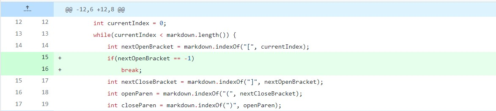
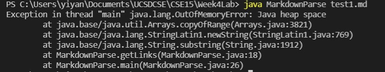
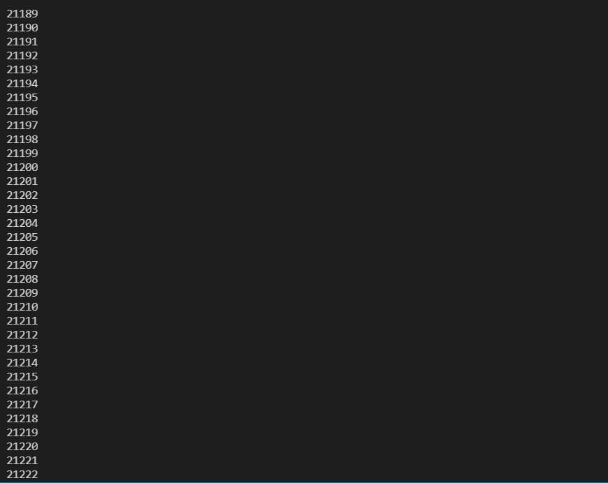
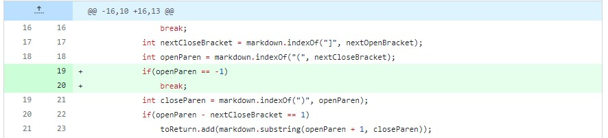
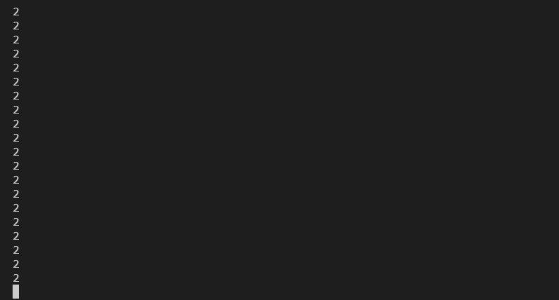
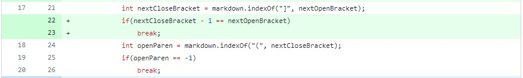
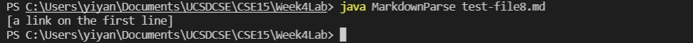

# Week 4 Lab Report 2 ##
Yiyang Chen  
A17053204  

## Change 1 ##  
  
[Failed File1](https://github.com/yi113/markdown-parse/blob/main/test1.md?plain=1)  
There seems to be a weird error regarding out of memory.
  
Then when I added a print statement, it became clear that there's an infinite loop happening.

The out of memory issue has to do with the extra empty space or lines in the input file. Since our while loop's condition is to see if the currentIndex is less than markdown's length. And in our loop, we add currentIndex by 1 so we won't search the same set of brakets during the next iteration. However, when there are empty spaces at the end, adding 1 won't terminate the loop; space counts as characters. Then when the loop tries to find braket, since there aren't any, it will return -1 which effective means we start searching again at the begining of the file. This is the logical bug that cuased the inifinte loop and memory issue. To fix it, we simply added a check to see if nextOpenBraket is ever -1. In that case, terminate the loop imediately because there are no more links to be found.   
___
## Change 2 ##  
  
[Failed File2](https://github.com/yi113/markdown-parse/blob/main/test3.md)  
A similar issue invloving infinite loop.  
  
This issue is similar to the first one and that an infinite loop has occured when I added a print statement within the loop. This is because the testfile here contains only brackets, no parenthesis. Therefore, when the loop is executing, the index of either parentheses can only return -1. Which is bad since the way we assign currentIndex is by adding 1 to the last closed parentheses. Therefore, the loop never terminates. To fix it, we did the similar thing of terminating the loop when ever the openParen is -1. 
___
## Change 3 ## 
   
[Failed File3](https://github.com/yi113/markdown-parse/blob/main/test-file8.md)  
The output should be empty.  
  
A supposed link still appreared as out output even though there shouldn't be one because the inside of the brakets are empty in the md file. Every character that we want to check are present so nothing seemed wrong for our program. However, empty brakets won't geenrate hyperlinks so our program shoudn't have fetched it. To fix it, we added a check to is if there are any characters between the two brakets. If none are present, we terminate the loop.  

