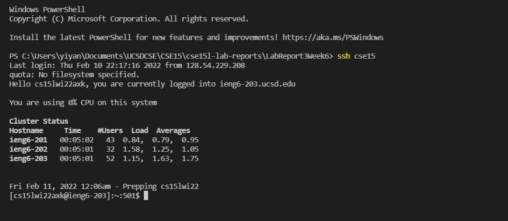

# Week 6 Lab Report 3 ##
Yiyang Chen  
A17053204  
___
## Use VScode to edit a config file in .SSH ##  
  
I chose cse15 as my allias and not ieng6 since I am also taking other cse courses right now.  

## ssh into ieng6 without password ##
   
Logged in with just `ssh cse15`, no further prompts.

## scp all java files to ieng6 without password ##
   

