Yiyang Chen  
A17053204

# Lab Report 4 #
## Links ##  
[my repository](https://github.com/yi113/markdown-parse)  
[reviewed repository](https://github.com/yih365/markdown-parse)  

## Expected Output ##  

- Snippet 1  
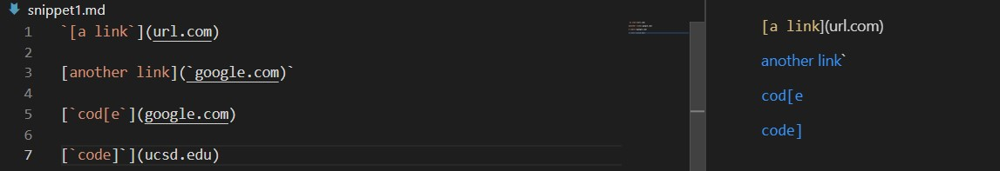  
The output should be ``[`google.com, google.com, ucsd.edu]``

- Snippet 2
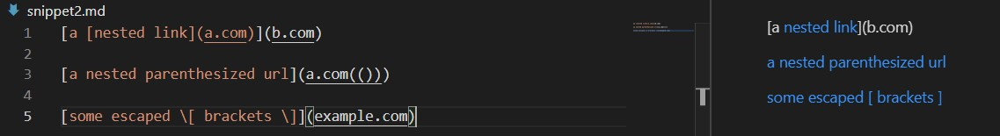  
The output should be ``[a.com, a.com(()), example.com]``  

- Snippet 3 
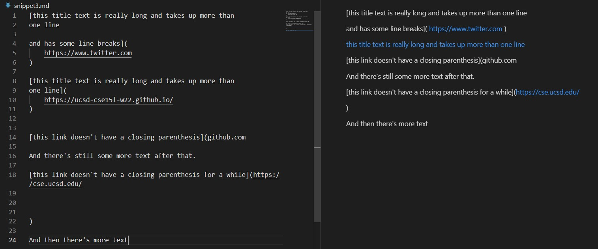 
This one is a bit unique, since from the preview I can see that the link for twitter is already accessable. I then tested myself and it turns out that `https://` followed by something will be randered as a clickable link by markdown, and there's no need to put it in the `` format that we have been dealing with. So here, if I assume that our program should find all links that will be accessable on the randered output, then twitter's url should be an output that we are expecting.   
The output should be ``[https://www.twitter.com, https://ucsd-cse15l-w22.github.io/, https://cse.ucsd.edu/]``  

## JUnit test ##  
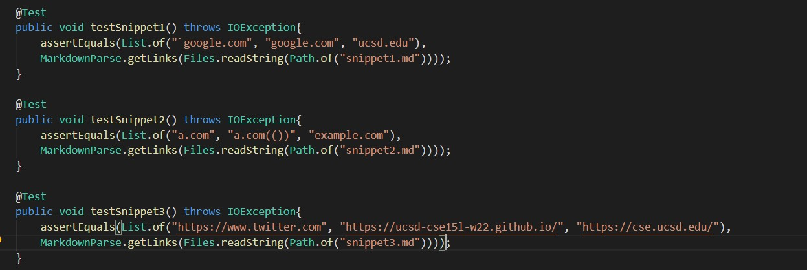  

## My output ##  
- Snippet 1 fail
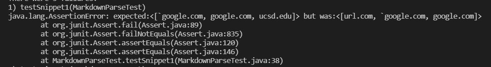
- Snippet 2 fail
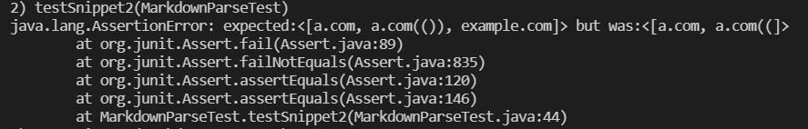
- Snippet 3 fail
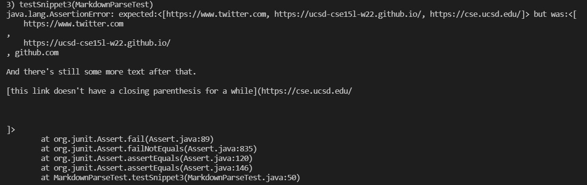

## Reviewed repo output ##
- Snippet 1 fail
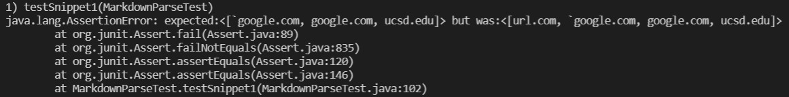
- Snippet 2 fail
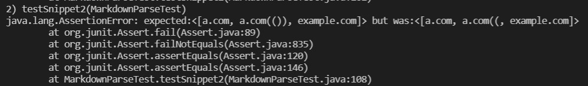
- Snippet 3 fail
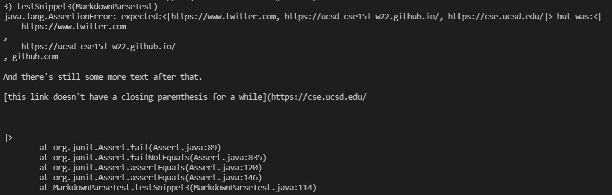

## Possible Fix ##
- Snippet 1  
I don't think there's an easy way to fix problems relating to backticks. In fact, I still don't know even what exactly happens when there are multiple backticks. There are just too many different possibilities that I don't think can be addressed easily. 
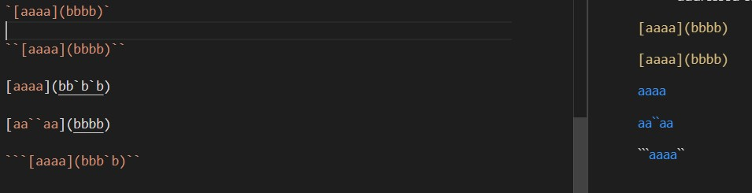

- Snippet 2  
I think problem 2 can be fixed. First, ignoring escaped characters is esay. When searching for either a bracket or parenthesis, we just need to check if there's also a backslash infront of it. If there is, we ignore the current character and continues to search it. To fix nested parenthesis, we have to continue our search for close parenthesis while the index is less than the next open bracket, or file length if there isn't an open bracket anymore. Finally, nested bracket seems to work for my code already, so this part doesn't need extra work. 

- Snippet 3  
I think problem 3 can also be fixed. After my testing, it seems that as long as there aren't any consecutive newline characters and that newline characters don't exist within the parenthesis, the link will be randered out. So I think after finding the correct index for the brackets and parenthesis, we need check if there are any instances of consecutive newline characters and if any character is within the index of open paren and close paren. 