Yiyang Chen  
A17053204

# Lab Report 5 #

## How To Find Output Differences  
From lab 9, I've done enough so that the results can be displayed as such  
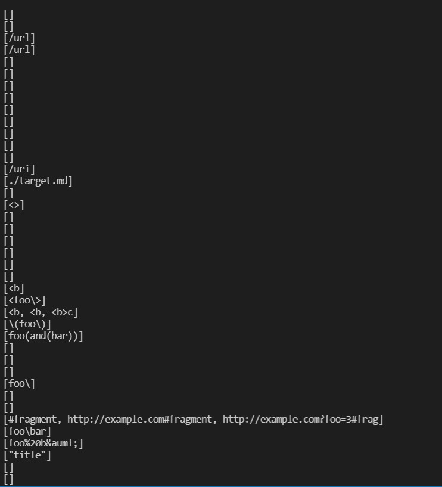   
But then, I noticed that some files are actually not provided in order, so the order in which the results are printed don't necessarily match the file number.  
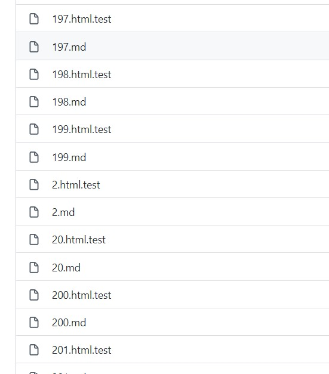 
So when pringting the linked list, I made it so that it also prints out the file name with this line of code: `System.out.println(dirOrFile.getName() + " " + links);` So the putput looks like This:  
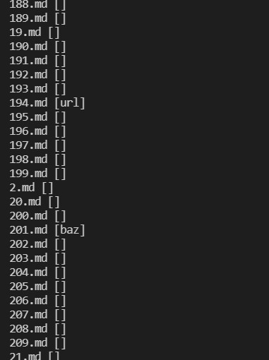  

Then I used `>` to redirect the result into two files. One for mine MarkdownParse `myResult` and one for the one provided in lab 9 `refResult`. And then, I used the `diff` command with the `-y` flag which shows me the two files in parallel and their differences with mine outputs at the left side.  
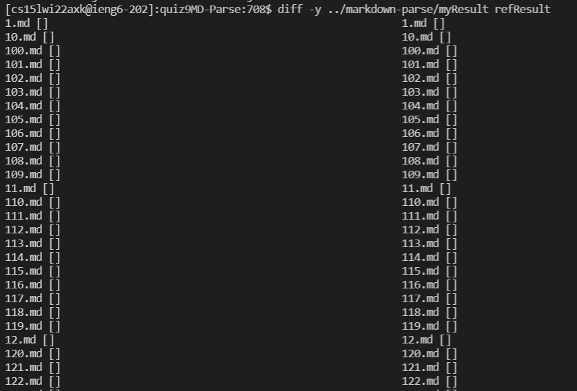  

## Differnece 22.md ##  
The results are different as shown below   
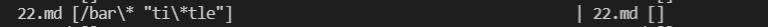   
But when I used the preview function, it seems like neither implementation are correct.   
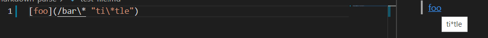   
Upon doing some reaserch, it seems like md allows for a "title" to be placed after the link which will show up instead of the link when the mouse hovers over. However, it's not part of the link and should not be displayed. 
The actual link without the title should be: `/bar*`, with the backslash not counting as a character. I don't know the interaction of backslash and other escape characters; but in this case, it seems like the link we try to fetch is just the text without the backslash.   
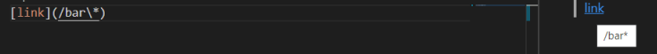   
## Possible Fix ##  
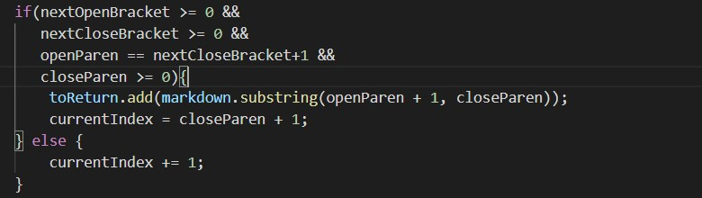
I think changes should be made in this part of my code. I simply included everything between the parentheses. So before adding the substring to `toReturn`, I should check if there are two double quotes within the parentheses. Using a while loop, use `indexOf` to check for the exsistence of double quotes. If there are atleast 2, since quotes can be part of the title, then the link substring should be taken from openParen to the first double qupte, not closeParen. 
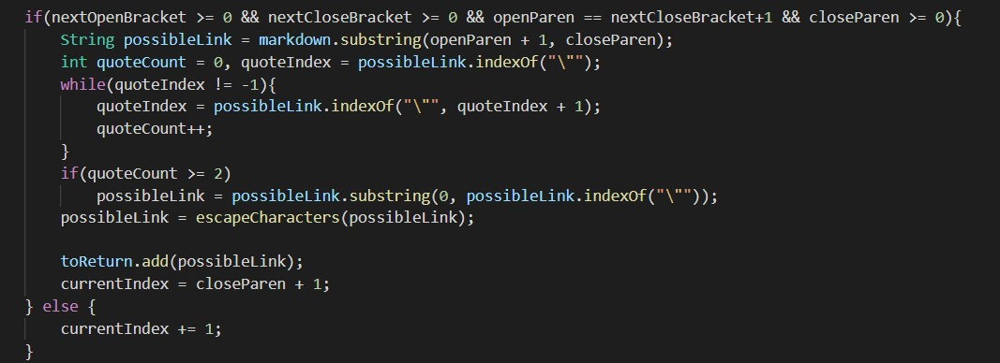  
Also, the `\*` needs to be addressed so I wrote a helper function called `escapeCharacters`. I need to look for the combination of `\*` in this case and just extract the `*`.  
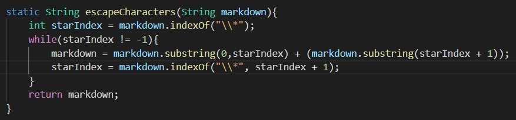  
With these changes, I believe the program now produces the correct link.  
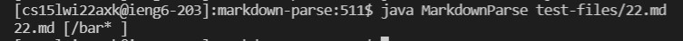  

---

## Difference 494.md ##   
The results are different as shown below.  
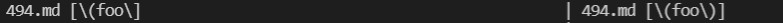   
Once again, I believe both implementations are wrong.  
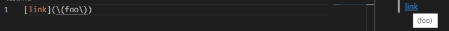   
It seems like both inner parentheses are escaped using backslash, therefore, the link shouldn't contain any backslashes. 
mine implementation is wrong because it simply finds the first closeParen; which in this case should be part of the link because it is escaped.  
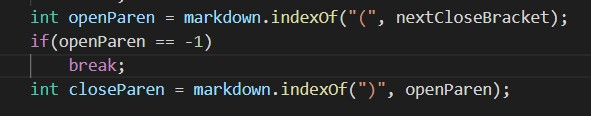  
## Possible Fix ##  
I can fix this by first ignore parentheses that has a backslash in front of them. I would use a while loop to traverse through any closeParen that has been escaped.   
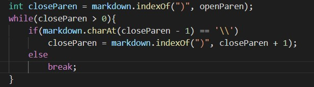  
Then once I did that, I would just modify my `escapeCharacters` function so that it would remove the backslash just like it did in the last example.  
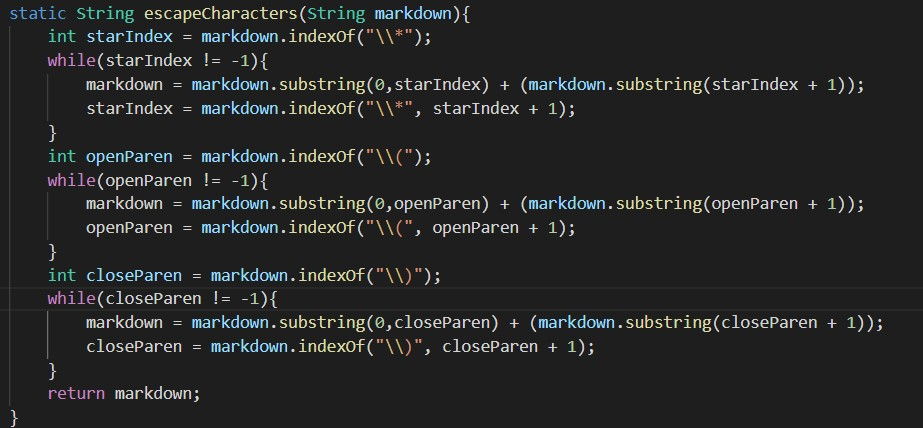  
It now displays the intended output  
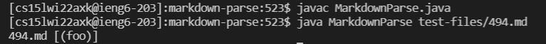  

