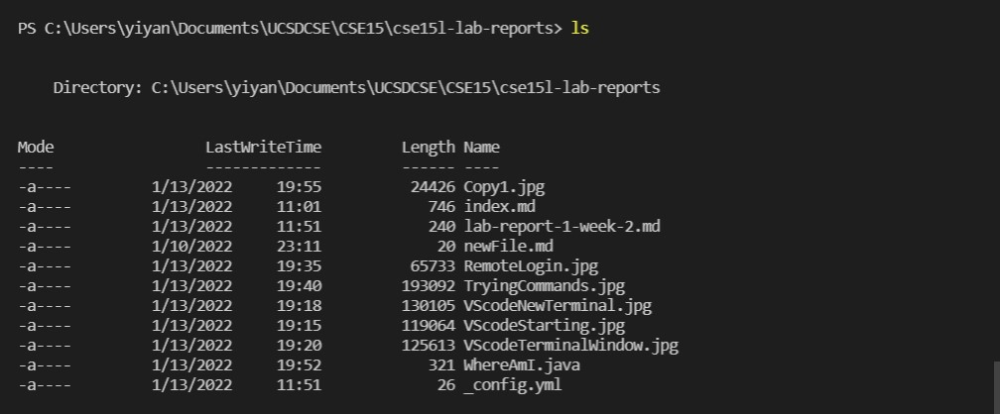
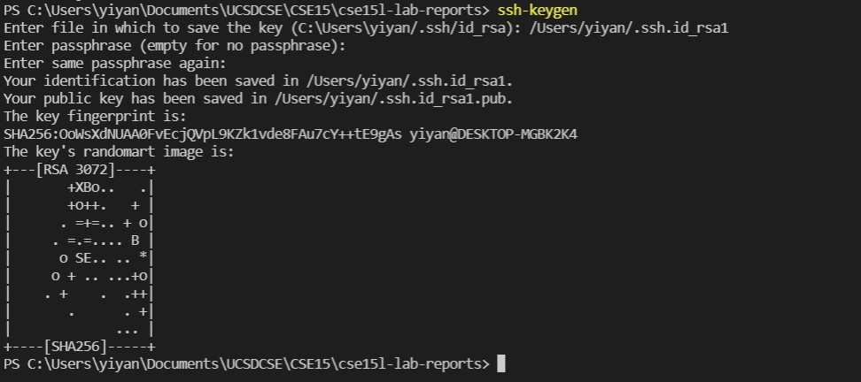

# Week 2 Lab Report #
Yiyang Chen  
A17053204
___

**1. Install VScode**  
Download VScode from your broswer and follow the prompted directions. When finished, open VScode and you should see an image similar to the one below.  
  
___
**2. Remotely Connecting**  
Once VScode has been successfully installed and opened, click "Terminal" and then "New Terminal" located at the top of the menubar.  
  
A new terminal window should now be opened at the bottom of your window.
  
Enter command in the format  
`ssh cs15lwi22xxx@ieng6.ucsd.edu` (replace "xxx" with the username you are assigned with). You can find your username and are **required** to change your password once before having access to it. All of which can be done through this link. [Account Lookup](https://sdacs.ucsd.edu/~icc/index.php)  
Once you've changed your password, you should ssh into your account and be prompt for a password. Don't freak out if nothing shows up as you type things, that's meant to happen.  
Once you logged in, you should see the following lines, with your own username of course.  
  
___
**3. Trying Some Commands**  
You can now try to type some commands which may not be available on other operating systems, and figure out what they do.
Some commands you should try are `ls`, `ls -lat`, `cd`, `cd ~`, `mkdir newDir`  
  
`ls` for example, lists the content(folders and files) inside your current directory. The "-" symbol is a way to sort of add more functions to the command. In this case, "a" means also show hidden files, "l" means to show in a longer format that includes more information, and "t" means the contens are sorted by date of modification.
___  
**4. Moving Files with scp**  
One very useful comman is scp, this allows files to be copied from the remote server to your own computer and viceversa. To do so, exit your remote server by enterying "exit", then, type the command with the following syntax  `scp \<source location\> \<destination\>`  
For example, from the previous image, you can see I have a "WhereAmI.java" file on my remote computer. I will now proceed to copy it to my own computer by typing `scp cs15lwi22axk@ieng6.ucsd.edu:~/WhereAmI.java`.  
Notice the destination as just a single ".", this simply means current directory. 
  
   
And the file is now in my local computer.
___
**5. Setting an SSH Key**
Now one thing you might've noticed, login in and cp both required you to type passwords, which can get very tedious. But there's a way to skip that process.  
For that, enter your local termial and type `ssh-keygen` and you should see the following.  
  
Save the file into your location of choice (or simply skip and press enter), then skip the paraphrase part.  
Now, you should see two files added to your computer, the one with the "p" symbol is the public one, and that's the one that needs to be compied to your remote server  
  
Now, using the scp command, copy the "id_rsa.pub" file to the remote server under a directory called ".ssh" and name it authorized_keys.  
The comand is as follows "scp ./ssh/id_rsa.pub cs15lwi22axk@ieng6.ucsd.edu:~/.ssh/authorized_keys". Of course, make sure to change the username and the specific path you are in in your current directory as needed.  
By now, you should be able to ssh without typing passwords and the key file should be stored in your remote server's ".ssh" directory.  
  
___
**6. Optimizing Remote Running**  
If you only need to run a few commands, or maybe literally just one, then there's a quicker way to do so then login in to your server.  
<<<<<<< HEAD
By typing `ssh cs15lwi22axk@ieng6.ucsd.edu \<command>` on your local terminal, you can actually get results from your remote computer. 

=======
By typing "ssh cs15lwi22axk@ieng6.ucsd.edu \<command>" on your local terminal, you can actually get results from your remote computer. 

>>>>>>> 77980218046a618de82fceb7387b70e98396c3f6
